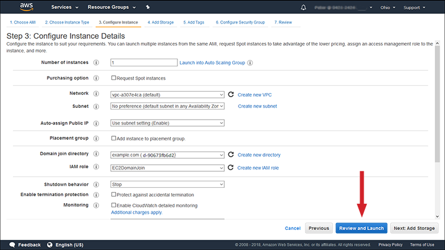
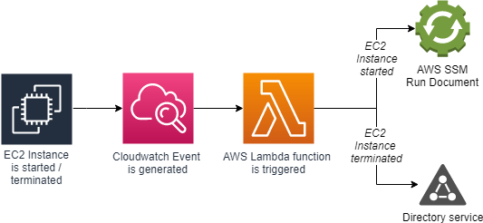
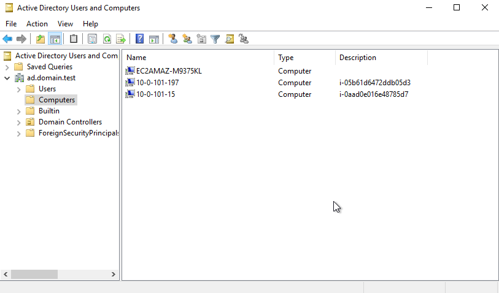
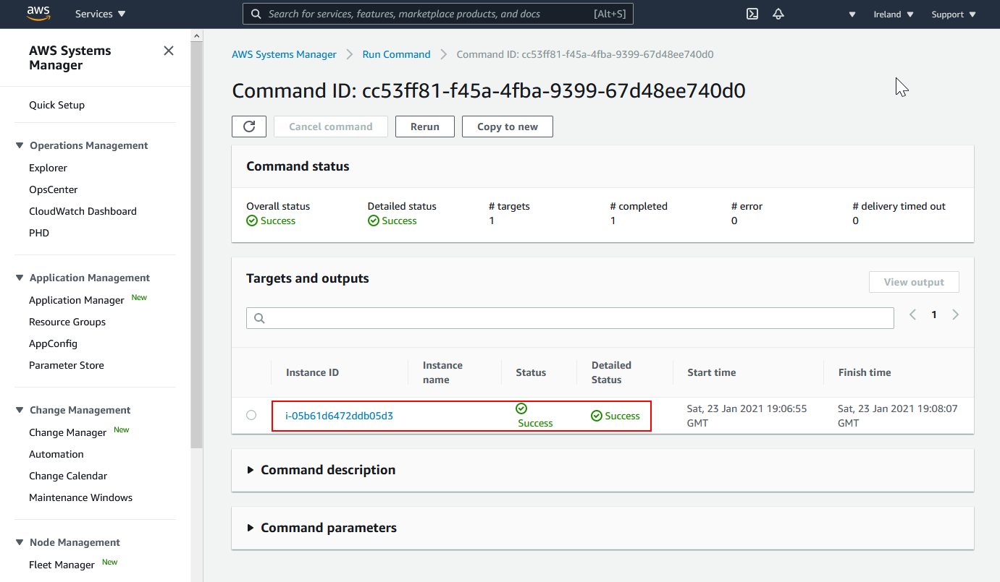

# Directory service - secure

- [Directory service - secure](#directory-service---secure)
  - [Motivation](#motivation)
  - [A closer look at the joining document](#a-closer-look-at-the-joining-document)
  - [A closer look at DNS records resolution](#a-closer-look-at-dns-records-resolution)
  - [Effortless computer management](#effortless-computer-management)
    - [Automation of EC2 registration and deregistration from AD](#automation-of-ec2-registration-and-deregistration-from-ad)
    - [Potential improvements](#potential-improvements)
  - [How to use this repository?](#how-to-use-this-repository)
  - [Troubleshooting](#troubleshooting)
    - [Is the EC2 instance really joined to the AD?](#is-the-ec2-instance-really-joined-to-the-ad)
  - [Extra sources](#extra-sources)
## Motivation

This story lives as a GitHub repository where I keep track of actual infrastructure configuration and this text. I will be very grateful if you consider sending pull-requests with either infrastructure configuration or textual changes there. It would be so great if this initial try changed into something anybody can effortlessly use in infrastructures.

This blog's ultimate goal is to conserve all the knowledge about managing the Active Directory (AD) domain in the cloud I gathered over a couple of past months. Most of the information is transferable to on-premise, e.g., GNU\Linux and AD, but Amazon AWS Directory services.

So here we go. 

AD is a Microsoft technology allowing to manage resources inside a company. Theoretically, a company of any size longing from small business to an international enterprise. There are plenty of good sources dealing with AD specific topics, from the basics to deep dive topics. For this writing, a reader can look at the AD as a server-side software where computers can be registered to and user accounts can be centrally managed. Having such a setup, users can be granted rights to login to specific servers and so on. Subsequently, such a user account can log in using one password that is always the same and managed and known by the user only, no matter which server is logging. Additionally, the single-sign on (SSO) technique can be used, so the user provides his/her credentials just once upon a time, and a unique authenticating token is used for login onto the server instead of credentials.

Basically, such a configuration allows removing all public ssh keys from the use, forming one of the [Zero trust](https://en.wikipedia.org/wiki/Zero_Trust_Networks) pillars.

Due to the AD origin, created by Microsoft around year 2000 which is when Microsoft literally hated Linux, the server registration process AKA joining used to be a bit clumsy. Historically, the joining process used to be a very manual process requiring configuration of LDAP, Kerberos, some Samba components, and DNS, so the Linux's authentication layer could work with AD. Joining a Linux server felt more like hacking then a simple task. On top of that, this layer could be slightly different depending on the used Linux distribution. In other words, the Linux joining process was not a piece of cake. Luckily, with the advance of technologies such as [RealmD](https://www.freedesktop.org/software/realmd/) and [SystemD](https://www.freedesktop.org/wiki/Software/systemd/) that are de-facto standards for all modern distributions, the joining process has become relatively straightforward. Nevertheless, an administrator needs to log in onto the server and run through a few steps before joining an AD domain.

On the same page, forming an AD installation requires some knowledge. Here comes Amazon AWS with [AWS Directory Service](https://aws.amazon.com/directoryservice/), which delivers AD as a Service. AWS delivers several flavors of AD installations, but all flavors deliver fully functional AD installation within a matter of minutes after installation. The AD can be installed through AWS web console, AWS Cloudformation, or [Terraform](https://registry.terraform.io/providers/hashicorp/aws/latest/docs/resources/directory_service_directory). The advantage of AD delivered by AWS is its integration allowing SSO or server joining through *Launch instance* form. 



This joining method is a great acceleration for server joining to AD. This functionality was only usable by Windows server, and recently has been enabled for GNU\\Linux distributions with AWS SSM agent VERSION (TODO) installed. No surprise, this embedded joining process uses AWS System Manager (SSM) Run Document module in the background. Specifically, AWS SSM provides the managed document *AWS-JoinDirectoryServiceDomain*, which can be easily used. The example of a Windows server joining is attached in *[ec2-management.tf](ec2-management.tf)*.

Bear in mind that AWS SSM documents are only triggered by creating a document *attachment* which can be a manual operation or is added by a 3rd party component such as *Launch instance* wizard. Subsequently, it means no AWS SSM document would be removing servers from AD once they are deleted. Technically, it is not even possible without the operating system's direct interaction. Computer deregistration's impossibility is a very significant disadvantage because the cloud is a subject of change, and servers can be started and deleted many times a day. In other words, the necessary integration provided by AWS is great for Cloud deployments, which are mimicking on-premise deployments with semi-permanent servers. However, stale computer objects can be pestering admins by removing plenty of servers manually or using some periodically triggered scripts.


## A closer look at the joining document

AWS uses the marketing term *[Seamless](https://docs.aws.amazon.com/directoryservice/latest/admin-guide/launching_instance.html)* joining where they emphesize the fact an user does NOT have to login onto the server and perform the joining procedure manually. How is that done you ask? First of all there is no magic. The necessary steps are automated using AWS SSM Run Document scripts which are executed on the EC2 instance directly. It means the sensitive data has to be handled on the AWS side without permanent access of EC2 instance to the joining credentials. The *AWS-JoinDirectoryServiceDomain* document utilizes *aws:domainJoin* AWS SSM step which works on both Microsoft and Linux EC2 instances. However, the mechanism is totally different.

The Windows joining mechanism uses one time password to a [pre-generated computer object](https://docs.aws.amazon.com/cli/latest/reference/ds/create-computer.html) which is created by the joining EC2 instance thanks to the *AmazonSSMDirectoryServiceAccess* AWS Identity and Access Management ([IAM](https://aws.amazon.com/iam/)) policy. The Linux joining processes, however, requires pre-shared credentials that are stored in AWS SecretManager. The reason for that is the official document tends to support inter-domain trust [mechanism](https://github.com/aws/amazon-ssm-agent/pull/324) hence they need to use [Winbind](https://www.samba.org/samba/docs/current/man-html/winbindd.8.html) which sadly does NOT suport joining using one-time passwords. The alternative to Winbind[3](https://www.samba.org/samba/docs/current/man-html/winbindd.8.html) is [SSSD](https://sssd.io/) which has got the domain trust under active [development](https://sssd.io/docs/design_pages/subdomain_configuration.html). Hopefully, in the close future the SSSD will replace Winbind, so even official joining AWS SSM document wont require password stored in SecretManager.

## A closer look at DNS records resolution

The joining procedure requires [some](https://www.tecmint.com/manage-samba4-dns-group-policy-from-windows/) DNS records in place, so the joining mechanism can properly discover all necessary components, e.g, LDAP and Kerberos interface. Therefore, VPC DHCP options need to be extended, so IP addess of domain controllers are used by all computers for the DNS resolution.

```
resource "aws_vpc_dhcp_options" "dns_resolver" {
  domain_name_servers = aws_directory_service_directory.simpleds.dns_ip_addresses
}

resource "aws_vpc_dhcp_options_association" "dns_resolver" {
  vpc_id          = module.vpc.vpc_id
  dhcp_options_id = aws_vpc_dhcp_options.dns_resolver.id
}
```

Interestingly, this DHCP configuration is perfectly fine for deployments in one region or to geographically close regions, e.g., multiple VPCs in the same region. Such DHCP options can cause some issues for cross-ocean deployments. The main problem here is that all DNS traffic is centralized to domain controllers; which means, Route 53 zones assignment for remote regions are not considered, etc., In other words, all VPCs will resolve the same Route 53 zones, as VPC where AWS Directory service is deployed to. Additionally, failure of domain controller can parallize whole network. The ideal solution is if every single EC2 instance was using its regional local DNS resolver, i.e., .2 address, i.e., 169.254.169.253, and the domain specific traffic was forwwarded to domain controller only.

Such functionality can be delivered via Route 53 Resolver. This is probably the most scallable solution, but it cames with [price](https://aws.amazon.com/route53/pricing/#Route_53_Resolver) and puts strain on the VPC networking.

Alternativelly, for Linux centric deployments, as Windows does NOT suppot split DNS resolution, the Linux instances can be configured to use DNSmasq or SystemD-resolver for DNS traffic routing. The DNSmasq is not broadly used for local DNS caching as systemd-resolver in Linux distributions. The example configuration looks like this

```
root@server:~# cat /etc/systemd/resolved.conf
[Resolve]
DNS=IP1 IP2
#FallbackDNS=
Domains=ad.domain.test
#LLMNR=no
#MulticastDNS=no
#DNSSEC=no
#DNSOverTLS=no
Cache=yes
#DNSStubListener=yes
#ReadEtcHosts=yes
```

Subsequently, the configuration can be verified using `systemd-resolve --status` command.

This article will further use the last option. In order to encompase this functionality into joining process, the official AWS SSM Document *AWS-JoinDirectoryServiceDomain* needs to be altered. The modification is stored in *ssm.tf* file. The enclosed modification of original joining document contains steps necessary for password-less joinig process.

## Effortless computer management

All the previous sections covered the technological bases leading to the moment an Linux system (Ubuntu specifically, but the joining document can be updated for any SystemD based Linux distribution) can be seamlessly joined. The join, however, is triggerd by an user who either selects the directory using the dropdown menu during *Launch instance* or assignings an AWS SSM document to an EC2 instance. The downside of this AWS SSM backed process is that it is actually an manuall process. Manuall processes should be pruned from cloud based deployments as much as possible. Additionally, computer objects remain in AD even after EC2 instances are terminated hence more manuall cleaning work is necessary. The automation of an EC2 instance removal and registration is topic of further sections.

I personally believe that EC2 instance joing should be controlled by EC2 tags, and should be as simple as possible e.g., assign Domain:Join = True/False tag. 

<!-- TODO: Extend the example about joining based on EC2 tag change -->

### Automation of EC2 registration and deregistration from AD

First let's define expectations and put them on the table. Expected behaviour:

* When a new EC2 instance is started, and the tag "Domain:Join" is set to True, the EC2 instances is joined to the AD.
* When a new EC2 intances is started, but the tag "Domain:Join" is missing or set to False, the EC2 instance is not joined to AD.
* When an already joined EC2 instance is terminated, the computer object is removed from AD.
* When an EC2 instance that is not joined to AD is terminated, no objects are removed from AD.

AWS does not provide such a functionality, but there are services which can be used for particular operations, as were reviewed in the previous sections. It means, all the recalled components need to be somehow "glued" together. The best generall purpose glue is AWS Lambda in the Amazon AWS environment, so lets use it. AWS Lambda allows implementation of a logic using just a code without too much wory where the code is going to run. The only missing piece is the automation triggering when EC2 instance state change happens. Simple answer here, AWS CloudWatch [Events](https://docs.aws.amazon.com/AmazonCloudWatch/latest/events/WhatIsCloudWatchEvents.html).

The whole chain is depicted in the following diagram. 



Notably, the path forming the computer deregistation terminates by the step using LDAP protocol directly. The deregistration is perfomed not from the EC2 instance using an AWS API call, but from the runtime environment of the AWS Lambda function, as AWS does not provide direct interaction with AD object via its API. In other words, the AWS Lambda function needs and elastic network interface (ENI) attached to a subnet which has IP connectivity with AD.

A computer object removal is priviledged operation, so the LDAP call needs to be authenticated. Storing non-volatile credentials in AWS Lambdas is a bad pattern, so the credentials should be stored in a secret store, e.g., AWS SecretManager. To simplify integration with other AWS processes, this process tends to stick with naming conventions used by [AWS](https://docs.aws.amazon.com/directoryservice/latest/admin-guide/seamlessly_join_linux_instance.html) that stores credentials in AWS SecretManager under path `aws/directory-services/d-xxxxxxxxx/seamless-domain-join`.

The computer registration operation is very simple, as the AWS Lambda function only needs to retrieve EC2 instance's metadata using *DescribeInstance* API call. Having the EC2 tag *Domain:Join=True* causes a new AWS SSM association is created. A tiny little catch here. As there is no specific AWS CloudWatch even indicating EC2 instance being created, but states are propageted. The meanigful states are PENDING and RUNNING for triggering EC2 registation. The catch is AD might already contain the computer object, as such an event is triggered by EC2 instance has been start-stopped while created a long time ago. Therefore, the registration process needs to look up to AD to check whether to start the registration process. The process might look like this:

```
procedure Registration
  event <- AWS CloudWatch event is received 

  if event[state] != PENDING then STOP
  if event[InstanceId] is registed in AD then STOP

  Create ssm assiciation object

  END
```

Similarly the deregistration process might look like this:

```
procedure DeRegistration
  event <- AWS CloudWatch event is received 

  if event[state] != TERMINATED then STOP
  if event[InstanceId] is not registed in AD then STOP

  Delete the computer object from AD via LDAP protocol

  END
```

That is all.

The actually code is implemented using Python language `function/main.py` and the actually registration to AWS is tackled again by Terraform in `lambda.tf`. Due to the necessary connectivity with AD via LDAP protocol, ENI has to be attached resulting in extra configuration of security groups, etc. The AWS CloudWatch events triggers and integration with the lambda code is formalized in `lambda_ec2trigger.tf`. Additionally, there are a few more `lambda_xxx.tf` files which are tackling some related technicalities. 

This lambda function is implemented and delivered as a regular deployment package, but as of Re:Invent 2020 it is possible to deliver the functionality via a container image as well.


A tiny little extra functionality is hidden in `lambda_cron.tf` which uses AWS CloudWatch cron-like service for triggering cleaning. This cleaning is practivally, just a workaround to the brittle LDAP interface to AD. Sometimes, the deregistration via LDAP timeouts, so the computer object just resides in AD. The periodical cleaning simply scan all EC2 instances and cross reference them with computer objects in AD. The forgotten computer objects are simply retried to delete.

### Potential improvements

Bear in mind, this implementation is just a proof of concept, so the code is ugly and not really recommendable for production usage. Even though it can be just downloaded, applied, and will work just fine. Nevertheless, 

 * This code should be put under module structure
 * Runtime can be converted to either AWS Lambda layer or container image for better reuse
 * For multi-region use the listener should be attached to AWS SQS, so the registration/deregistration code runs in only one region.
 * Use `default_domain_suffix` for sssd.conf for easier logging names, [see](https://gist.github.com/ceagan/bdaa1495272cfb97e40f).

## How to use this repository?

Technically speaking. This git repository can by just cloned. One needs to add following statement, for connectivity via technical accounts on the created EC2 instances

```
resource "aws_key_pair" "sshkey" {
  key_name   = "sshkey"
  public_key = "ssh-rsa XXXXXXX"
}
```

Then just install into your AWS account

```
terraform plan
terraform apply
```

After everything gets installed the default `Administrator` account is created within AD. Remote desktop is the tool for loggin in to the management node for adding new users, and monitoring how registration works or not.

## Troubleshooting

Let's have this terraform project deployed, so the 

**Domain name**: ad.domain.test

**Short domain name**: EXAMPLE

### Is the EC2 instance really joined to the AD?

Good question, so first of all make sure you know IP address and EC2 InstanceId of the server which should be joined to the AD. Test if you can login using your AD credentials, or just *EXAMPLE\Administrator* account which for *ssh* is *administrator@ad.domain.test*.

Lets have an server *i-05b61d6472ddb05d3* with IP address *10.0.101.197*.

1) Verify existence of computer object within AD using *Active Directory Users and Computers*
* The computer object should be in *Computer* directory
* If the expected computer is missing, here we are at the beggining of the rabbit hole. Go to step 2).



Notice the *Name* and *Description* fields, these should be used for server identification

* If the expected computer is present jump to X).

2) Verify the association has been created

* Every assiciation is created after the EC2 instance enters PENDING state, so search for AWS CloudWatch event in AWS CloudWatch Log groups for line like this:

```
{
    "version": "0",
    "id": "5ee58b8b-4646-bae4-64f8-ef4f0c3555e6",
    "detail-type": "EC2 Instance State-change Notification",
    "source": "aws.ec2",
    "account": "463421577793",
    "time": "2021-01-23T19:05:49Z",
    "region": "eu-west-1",
    "resources": [
        "arn:aws:ec2:eu-west-1:463421577793:instance/i-05b61d6472ddb05d3"
    ],
    "detail": {
        "instance-id": "i-05b61d6472ddb05d3",
        "state": "pending"
    }
}
```

* This event is printed by our AWS Lambda function, so if such a line is missing it means the problem is around *AWS CloudWatch Events*. Look around configuration of rule *EXAMPLE-JoinDirectoryServiceDomain*.
* Alternativelly, search for lines indicating AWS SSM documentat has ben associated with the EC2 instance.
  * `* Initiating join EXAMPLE-JoinDirectoryServiceDomain for instance i-05b61d6472ddb05d3`
  * `{'AssociationDescription': {'Name': 'EXAMPLE-JoinDirectoryServiceDomain', 'AssociationVersion': '1', 'Date': datetime.datetime(2021, 1, 23, 19, 5, 55, 332000, tzinfo=tzlocal()), 'LastUpdateAssociationDate': datetime.datetime(2021, 1, 23, 19, 5, 55, 332000, tzinfo=tzlocal()), 'Overview': {'Status': 'Pending', 'DetailedStatus': 'Creating'}, 'DocumentVersion': '$DEFAULT', 'Parameters': {'directoryId': ['d-936707b662'], 'directoryName': ['ad.domain.test'], 'directoryOU': ['CN=Computers,DC=ad,DC=domain,DC=test'], 'dnsIpAddresses': ['10.0.2.234 10.0.1.189']}, 'AssociationId': 'e2df9c8c-6999-47f1-9f95-edfde9545485', 'Targets': [{'Key': 'InstanceIds', 'Values': ['i-05b61d6472ddb05d3']}], 'ApplyOnlyAtCronInterval': False}, 'ResponseMetadata': {'RequestId': '76b4a3c7-e1f8-4d90-aba0-d1687b64f4fd', 'HTTPStatusCode': 200, 'HTTPHeaders': {'server': 'Server', 'date': 'Sat, 23 Jan 2021 19:05:55 GMT', 'content-type': 'application/x-amz-json-1.1', 'content-length': '588', 'connection': 'keep-alive', 'x-amzn-requestid': '76b4a3c7-e1f8-4d90-aba0-d1687b64f4fd'}, 'RetryAttempts': 0}}`
* Search for status of the AWS SSM Association: 

3) Verify the status of the EC2 instance directly
* Login using technical account is necessary. 
* In this example *ubuntu* user account, e.g., `ssh address -l ubuntu`
* Check state of join

```
ubuntu@lubuntu1:~$ realm list
ad.domain.test
  type: kerberos
  realm-name: AD.DOMAIN.TEST
  domain-name: ad.domain.test
  configured: kerberos-member
  server-software: active-directory
  client-software: sssd
  required-package: sssd-tools
  required-package: sssd
  required-package: libnss-sss
  required-package: libpam-sss
  required-package: adcli
  required-package: samba-common-bin
  login-formats: %U@ad.domain.test
  login-policy: allow-realm-logins
ubuntu@lubuntu1:~$ id EXAMPLE\\Administrator
uid=555000500(administrator@ad.domain.test) gid=555000513(domain users@ad.domain.test) groups=555000513(domain users@ad.domain.test),555000518(schema admins@ad.domain.test),555000572(denied rodc password replication group@ad.domain.test),555000512(domain admins@ad.domain.test),555000520(group policy creator owners@ad.domain.test)
```
 * In the case the output is similar, make sure you were trying to connect using correct credentials, or you have enough rights to login onto the specific server, but AD association seems to be correct.


## Extra sources

* https://tk-sls.de/wp/5180
* https://lucanuscervus-notes.readthedocs.io/en/latest/Windows/AD%20-%20Computer%20Accounts/
* https://giritharan.com/install-active-directory-management-tools-using-powershell/
* https://aws.amazon.com/blogs/security/how-to-domain-join-amazon-ec2-instances-aws-managed-microsoft-ad-directory-multiple-accounts-vpcs/
